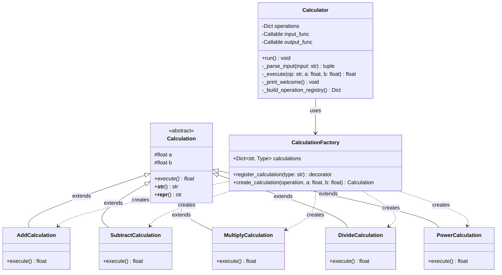

# C4 Code Diagram - Calculator Application

This diagram shows the code-level implementation details for key components of the Calculator Application.



## Code Details

### Factory Pattern Implementation

#### CalculationFactory Class
```python
class CalculationFactory:
    calculations: Dict[str, Type[Calculation]] = {}
    
    @classmethod
    def register_calculation(cls, calculation_type: str):
        def decorator(subclass: Type[Calculation]):
            cls.calculations[calculation_type.lower()] = subclass
            return subclass
        return decorator
    
    @classmethod
    def create_calculation(cls, operation, a: float, b: float) -> Calculation:
        operation_key = str(getattr(operation, "name", operation)).lower()
        calculation_class = cls.calculations.get(operation_key)
        if calculation_class is None:
            raise ValueError(f"Calculation type '{operation_key}' not registered")
        return calculation_class(a, b)
```

#### Calculation Base Class
```python
class Calculation(ABC):
    def __init__(self, a: float, b: float):
        self.a = a
        self.b = b
    
    @abstractmethod
    def execute(self) -> float:
        pass
    
    def __str__(self) -> str:
        result = self.execute()
        op_name = self.__class__.__name__.replace("Calculation", "")
        return f"{self.__class__.__name__}: {self.a} {op_name} {self.b} = {result}"
```

#### Concrete Calculation Example
```python
@CalculationFactory.register_calculation("add")
class AddCalculation(Calculation):
    def execute(self) -> float:
        return self.a + self.b
```

### REPL Implementation

#### Calculator Class
```python
class Calculator:
    def __init__(self, operations=None, input_func=None, output_func=None):
        self.operations = operations or self._build_operation_registry()
        self.input_func = input_func or input
        self.output_func = output_func or print
    
    def run(self):
        self._print_welcome()
        while True:
            try:
                user_input = self.input_func(">>> ").strip()
                if user_input.lower() == "exit":
                    self.output_func("Goodbye!")
                    break
                operation, operand1, operand2 = self._parse_input(user_input)
                result = self._execute(operation, operand1, operand2)
                self.output_func(f"{operand1} {operation} {operand2} = {result}")
            except ValueError as exc:
                self.output_func(f"Error: {exc}")
            except KeyboardInterrupt:
                self.output_func("\\n\\nGoodbye!")
                break
```

## Key Implementation Details

### Registration Flow
1. At import time, decorators execute
2. Each `@CalculationFactory.register_calculation("type")` call registers the class
3. Registry (`calculations` dict) is populated before runtime

### Execution Flow
1. User enters command: `"add 5 3"`
2. `_parse_input()` extracts: operation="add", a=5.0, b=3.0
3. `_execute()` calls: `CalculationFactory.create_calculation("add", 5.0, 3.0)`
4. Factory looks up `"add"` in registry → `AddCalculation`
5. Factory instantiates: `AddCalculation(5.0, 3.0)`
6. Calculator calls: `calculation.execute()` → returns `8.0`
7. Result formatted and displayed: `"5.0 add 3.0 = 8.0"`

### Error Handling
- **Division by zero**: `DivideCalculation.execute()` raises `ValueError`
- **Unknown operation**: Factory raises `ValueError` if not in registry
- **Invalid input**: Parser raises `ValueError` for malformed commands
- **All errors**: Caught by REPL, displayed to user, loop continues
