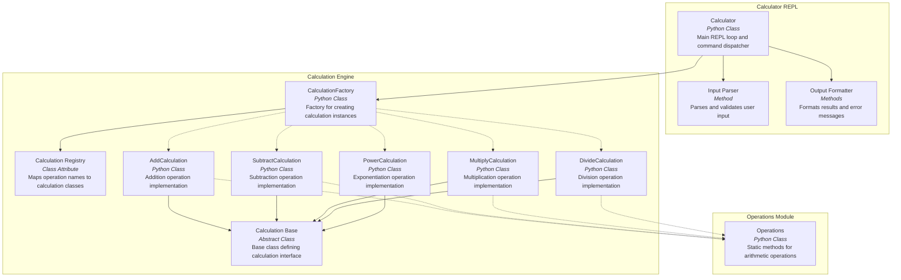

# C4 Component Diagram - Calculator Application

This diagram shows the internal components within each container of the Calculator Application.

## Description

This diagram shows the detailed component structure within each container of the Calculator Application.

### Calculator REPL Components

1. **Calculator**
   - Main class managing the REPL loop
   - Coordinates input parsing and output formatting
   - Handles exceptions and error recovery

2. **Input Parser**
   - `_parse_input()` method
   - Validates command format
   - Extracts operation and operands
   - Converts strings to numeric types

3. **Output Formatter**
   - `_print_welcome()` method
   - Formats calculation results
   - Displays error messages

### Calculation Engine Components

1. **CalculationFactory**
   - Central factory class
   - `create_calculation()` class method
   - `register_calculation()` decorator for registration
   - Manages the calculation registry

2. **Calculation Registry**
   - `calculations` class attribute (dict)
   - Maps operation names to calculation classes
   - Populated via decorator pattern at import time

3. **Calculation (Base)**
   - Abstract base class (ABC)
   - Defines `execute()` abstract method
   - Provides `__str__()` and `__repr__()` methods
   - Stores operands (a, b)

4. **Calculation Implementations**
   - **AddCalculation**: `a + b`
   - **SubtractCalculation**: `a - b`
   - **MultiplyCalculation**: `a * b`
   - **DivideCalculation**: `a / b` (with zero check)
   - **PowerCalculation**: `a ** b`

### Operations Module Components

1. **Operations**
   - Static class with arithmetic methods
   - Legacy support for direct operation calls
   - Methods: `addition()`, `subtraction()`, `multiplication()`, `division()`

## Design Patterns

- **Factory Pattern**: CalculationFactory creates calculation instances based on operation type
- **Registry Pattern**: Decorator-based registration of calculation classes
- **Template Method**: Calculation base class defines structure, subclasses implement `execute()`
- **Strategy Pattern**: Different calculation classes represent different arithmetic strategies
