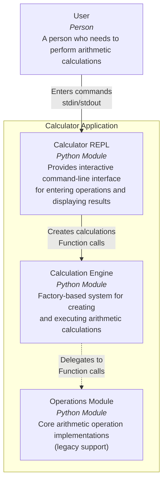

# C4 Container Diagram - Calculator Application

This diagram shows the high-level containers (applications, processes) that make up the Calculator Application.

## Description

The Calculator Application consists of three main containers:

### Containers

1. **Calculator REPL** (`app/calculator`)
   - Handles user input/output
   - Parses commands and validates input
   - Manages the interactive loop
   - Displays results and error messages

2. **Calculation Engine** (`app/calculation`)
   - Factory pattern implementation for creating calculations
   - Registry of available calculation types
   - Execution of arithmetic operations
   - Supports: add, subtract, multiply, divide, power

3. **Operations Module** (`app/operations`)
   - Legacy static methods for arithmetic operations
   - Provides core calculation logic
   - Used by calculation classes

### Interactions

- User inputs commands to the REPL module
- REPL creates calculation instances via the Calculation Engine
- Calculation Engine uses the Factory pattern to instantiate appropriate calculation classes
- Calculation classes use Operations Module for actual arithmetic
