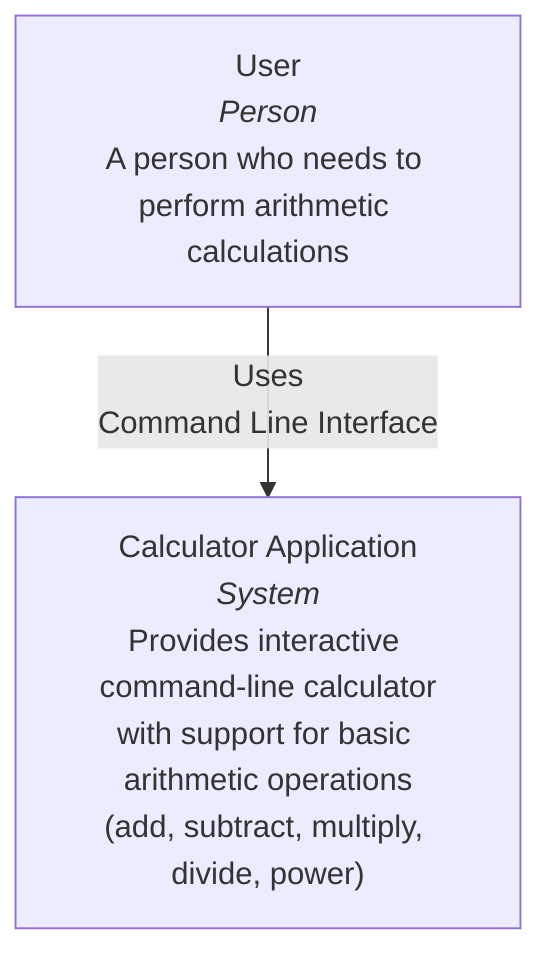

# C4 Context Diagram - Calculator Application

This diagram shows the Calculator Application in its environment and how users interact with it.

## Description

The Calculator Application is a standalone system that provides users with an interactive REPL (Read-Eval-Print Loop) interface for performing arithmetic calculations. Users interact with the system through a command-line interface where they can enter operations and operands.

### Key Elements

- **User**: End user who needs to perform arithmetic calculations
- **Calculator Application**: The complete system that processes arithmetic operations through a command-line interface

### Interactions

- Users interact with the Calculator Application via command-line input
- The application processes arithmetic operations and returns results immediately
