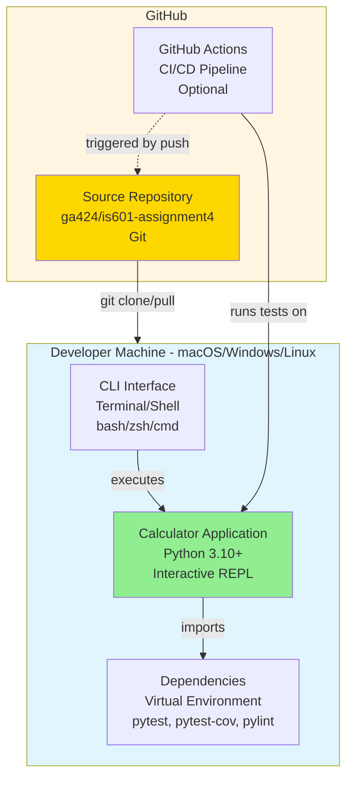

# C4 Deployment Diagram - Calculator Application

This diagram shows how the Calculator Application is deployed to infrastructure.



## Description

The Calculator Application follows a simple local development deployment model suitable for a command-line educational project.

### Deployment Environments

#### 1. Developer Machine (Primary Deployment)
The application is deployed and runs directly on the developer's local machine:

- **Operating System**: macOS, Windows, or Linux
- **Python Runtime**: Python 3.10 or higher required
- **Terminal/Shell**: Standard command-line interface (bash, zsh, PowerShell, cmd)

##### Key Components:
- **Calculator Application**: Main Python application running in the terminal
- **Virtual Environment**: Isolated Python environment with project dependencies
- **CLI Interface**: Terminal-based user interface using stdin/stdout

#### 2. Version Control (GitHub)
Source code is hosted on GitHub:

- **Repository**: `ga424/is601-assignment4`
- **Branch**: `main` (default)
- **Access**: Git over HTTPS/SSH

#### 3. CI/CD Pipeline (Optional)
Automated testing and quality checks:

- **Platform**: GitHub Actions (optional)
- **Test Runner**: pytest with coverage reporting
- **Triggers**: Git push, pull requests

## Deployment Process

### Local Development Deployment

1. **Clone Repository**
   ```bash
   git clone git@github.com:ga424/is601-assignment4.git
   cd is601-assignment4
   ```

2. **Create Virtual Environment**
   ```bash
   python3 -m venv venv
   source venv/bin/activate  # Mac/Linux
   venv\Scripts\activate     # Windows
   ```

3. **Install Dependencies**
   ```bash
   pip install -r requirements.txt
   ```

4. **Run Application**
   ```bash
   python main.py
   # or
   python -m app.calculator
   ```

### Testing Deployment

1. **Run Tests**
   ```bash
   pytest
   # or with coverage
   pytest --cov
   ```

2. **View Coverage Report**
   ```bash
   # HTML report
   open htmlcov/index.html
   ```

## Infrastructure Requirements

### Minimum Requirements
- **CPU**: Any modern processor
- **RAM**: 512 MB minimum (typical usage ~50 MB)
- **Disk**: 50 MB for application and dependencies
- **Network**: Required only for initial setup (git clone, pip install)

### Software Dependencies
- **Required**:
  - Python 3.10 or higher
  - pip (Python package manager)
  - git (for version control)

- **Optional**:
  - pytest (testing, in requirements.txt)
  - pytest-cov (coverage, in requirements.txt)
  - pylint (linting, in requirements.txt)

## Deployment Topology

```
┌─────────────────────────────────────────────┐
│         Developer Machine                    │
│  ┌───────────────────────────────────────┐  │
│  │  Operating System (macOS/Win/Linux)   │  │
│  │  ┌─────────────────────────────────┐  │  │
│  │  │  Python 3.10+ Runtime           │  │  │
│  │  │  ┌───────────────────────────┐  │  │  │
│  │  │  │  Virtual Environment      │  │  │  │
│  │  │  │  ┌─────────────────────┐  │  │  │  │
│  │  │  │  │  Calculator App     │  │  │  │  │
│  │  │  │  │  - app/            │  │  │  │  │
│  │  │  │  │  - main.py         │  │  │  │  │
│  │  │  │  └─────────────────────┘  │  │  │  │
│  │  │  └───────────────────────────┘  │  │  │
│  │  └─────────────────────────────────┘  │  │
│  │                                        │  │
│  │  ┌─────────────────────────────────┐  │  │
│  │  │  Terminal/Shell                 │  │  │
│  │  │  stdin ←→ Calculator ←→ stdout  │  │  │
│  │  └─────────────────────────────────┘  │  │
│  └───────────────────────────────────────┘  │
└─────────────────────────────────────────────┘
              ↕ git clone/pull
┌─────────────────────────────────────────────┐
│         GitHub Repository                    │
│  ga424/is601-assignment4                    │
└─────────────────────────────────────────────┘
```

## Scalability Considerations

This is a single-user, local command-line application with:

- **No network services**: Runs entirely locally
- **No persistent storage**: Stateless operation
- **No concurrent users**: Single terminal session
- **No deployment complexity**: Direct Python execution

For production calculator services, consider:
- Web-based interface (FastAPI/Flask)
- API deployment (Docker containers)
- Cloud hosting (AWS Lambda, Google Cloud Functions)
- Load balancing and horizontal scaling
- Persistent calculation history (database)

## Security Considerations

### Current Security Posture
- Python code execution in user space
- No external network connections
- Standard OS permissions
- Virtual environment isolation

### Recommendations
- Keep Python runtime updated
- Review dependencies for vulnerabilities (`pip audit`)
- Use official Python packages from PyPI
- Maintain git repository access controls
